<p align="center">
  <a href="https://github.com/alexskrypnyk/skilltest" rel="noopener">
  </a>
</p>

<h1 align="center">Test runner for AI agent skills</h1>

<div align="center">

[](https://github.com/alexskrypnyk/skilltest/issues)
[](https://github.com/alexskrypnyk/skilltest/pulls)
[](https://github.com/alexskrypnyk/skilltest/actions/workflows/test-php.yml)
[](https://codecov.io/gh/alexskrypnyk/skilltest)


</div>

---

skilltest is a standalone test runner for AI agent skills - the `SKILL.md`-based skills used by Claude Code and compatible runtimes. It ships as a single executable, reads one declarative `eval.yaml` per skill plus one repo-level `skilltest.yml`, and gives any skill repository two test suites.

A skill is prose, and prose is not an enforcement boundary. A skill that "should" call a particular binary, "should not" push to git, and "must not" leak credentials needs those properties checked by machinery. A skill that passes every structural check can still fail on a weaker model, an ambiguous prompt, or a task it was never triggered for. skilltest answers both questions.

| Suite | ✅ `deterministic` | 🔬 `llm` |
|---|---|---|
| Groups | `structure`, `security`, `hooks`, `transcript` | `live`, `judge`, `matrix` |
| Model | No | Yes |
| Network | No | Yes |
| Cost | Free | Spends tokens |
| When | Every push - this is the CI gate | Opt-in: locally, nightly, pre-release |

The deterministic suite checks skill structure, supply-chain security, enforcement hooks, and a recorded transcript against the skill's behavioural contract. No model, no network, no flakes. The llm suite runs the skill against real models, asserts that same contract on live transcripts, scores runs with an LLM judge, and answers the headline question: what is the smallest model this skill works on?

## Installation

skilltest is consumed as a tool, never as a project dependency - no Composer require, no vendor directory. Pick the artifact that fits the machine; all forms report the same `skilltest version`.

### Install script (recommended, requires PHP >= 8.3)

    curl -fsSL https://raw.githubusercontent.com/alexskrypnyk/skilltest/main/install.sh | bash

Downloads the latest release PHAR, verifies its SHA-256 checksum, and installs it to `/usr/local/bin/skilltest`, falling back to `~/bin` when that is not writable. Override the target with `SKILLTEST_INSTALL_DIR`. Pin a release with a `.skilltest-version` file in the repository, or with `SKILLTEST_VERSION=<tag>`.

### PHAR (manual, requires PHP >= 8.3)

    curl -fsSLO https://github.com/alexskrypnyk/skilltest/releases/latest/download/skilltest.phar
    curl -fsSLO https://github.com/alexskrypnyk/skilltest/releases/latest/download/skilltest.phar.sha256
    sha256sum -c skilltest.phar.sha256
    chmod +x skilltest.phar && mv skilltest.phar /usr/local/bin/skilltest

### Docker (no PHP on the host)

    docker run --rm -v "$PWD":/work -w /work \
      ghcr.io/alexskrypnyk/skilltest:latest

See [Docker images](#docker-images) for what the two published images are for.

## Usage

A consumer repository holds `skilltest.yml` at its root and one `eval.yaml` per skill:

```yaml
# skilltest.yml
version: "1"

paths:
  skills: skills
```

```yaml
# skills/my-skill/eval.yaml
version: "1"

contract:
  tools:
    allowed: [Bash, Skill]
    forbidden: [WebFetch]
  commands:
    forbidden:
      raw git mutations: pack:git-mutations

deterministic:
  transcript: fixtures/transcript.jsonl
```

`skilltest init` scaffolds an `eval.yaml` from an existing `SKILL.md`, and `skilltest record` runs one live trial and saves its transcript as the deterministic fixture. Then run the gate:

    skilltest

`run` is the default command, so a bare `skilltest` runs the deterministic suite and the coverage gate. Exit codes are load-bearing: `0` pass, `1` fail, `2` configuration error.

### Commands

| Command | What it does |
|---|---|
| `run` | Deterministic suite (structure, security, hooks, transcript) plus the coverage gate. The default command |
| `structure` | The structure group alone: every skill's files are well-formed and honest |
| `security` | Scan every shipped skill file for danger patterns |
| `validate` | Schema- and coherence-validate `skilltest.yml` and every `eval.yaml` |
| `coverage` | Render the skill-to-eval coverage grid and enforce the coverage gate |
| `tokens` | Count tokens in skill markdown, or compare counts against a git ref |
| `init` | Scaffold an `eval.yaml` for a skill directory from its `SKILL.md` |
| `llm` | Live suite: headless trials asserted against the contract, gated on a pass rate |
| `matrix` | Run the model ladder and report the minimal model per skill |
| `record` | Run one live trial and write its transcript as the deterministic fixture |
| `grade` | Re-grade a transcript or re-score a saved run without executing an agent |
| `gate` | Compare a run against a committed baseline and fail on regression |
| `compare` | Per-task, per-model, and aggregate deltas between two or more results files |
| `report` | Render a saved `results.json` as a terminal summary or self-contained HTML |
| `cache` | Manage the llm result cache |
| `migrate` | Check a config or results file against the current schema and rewrite it |
| `self-update` | Download, verify, and install the latest release |
| `version` | Tool version, supported schema versions, and build info |

Run `skilltest <command> --help` for each command's flags. `--json` emits the machine-readable results document; `--interpret` appends a plain-language reading of the result and a concrete next step.

## Docker images

Two images are published, because Docker plays two unrelated roles here.

| | `skilltest` (tool image) | `skilltest-agent` (agent image) |
|---|---|---|
| Registry | [`ghcr.io/alexskrypnyk/skilltest`](https://github.com/alexskrypnyk/skilltest/pkgs/container/skilltest) | [`ghcr.io/alexskrypnyk/skilltest-agent`](https://github.com/alexskrypnyk/skilltest/pkgs/container/skilltest-agent) |
| Contains | The skilltest PHAR on a PHP runtime | The Claude Code CLI plus git, curl, jq on Node |
| Role | Runs skilltest itself | The sandbox a skill under test runs *inside* |
| Used by | Anyone running the deterministic gate without PHP | skilltest, for `--env docker` llm trials |
| Credentials | None, ever | `ANTHROPIC_API_KEY` passed at container start |
| Source | [`.docker/Dockerfile.tool`](.docker/Dockerfile.tool) | [`.docker/Dockerfile.agent`](.docker/Dockerfile.agent) |

Keeping them separate keeps the trust boundary honest. The tool image is the thing you trust: it ships no agent CLI and never receives credentials, so the CI gate cannot make a network call or spend a token. The agent image is the thing you do *not* trust: a skill is arbitrary instructions, so live trials run it in a throwaway container that only ever sees what was passed in deliberately. Merging them would put an agent CLI and an API key inside the image that gates every push.

They also change on different schedules. The tool image is pinned and reproducible, rebuilt when skilltest is released. The agent image deliberately tracks the current Claude Code CLI, because testing against a stale agent tests nothing.

### Publishing

[`.github/workflows/release-docker.yml`](.github/workflows/release-docker.yml) builds and pushes both images to GitHub Container Registry on every pushed tag. Each image gets a tag matching the release; `latest` moves only for a stable `X.Y.Z`, so a pre-release such as `1.2.3-rc1` publishes its own tag and leaves `latest` alone. The tool image compiles the PHAR inside its builder stage and takes the release tag as a `VERSION` build argument, so `skilltest version` inside the image matches the tag it was built from.

### Running the tool image

Mount the repository under test at `/work` and pass any command:

    docker run --rm -v "$PWD":/work -w /work \
      ghcr.io/alexskrypnyk/skilltest:latest

    docker run --rm -v "$PWD":/work -w /work \
      ghcr.io/alexskrypnyk/skilltest:latest validate

    docker run --rm -v "$PWD":/work -w /work \
      ghcr.io/alexskrypnyk/skilltest:latest coverage --format=markdown

The entrypoint is `skilltest`, so the first argument is a command, not a binary name. A bare invocation runs the deterministic gate.

### Running the agent image

skilltest starts agent containers itself when a run asks for the `docker` environment, so this image is rarely run by hand:

    skilltest llm --env docker

Point that at a different base, and add project tooling on top, through `llm.docker.image` and `llm.docker.setup` in `skilltest.yml`. To inspect the image directly:

    docker run --rm -it ghcr.io/alexskrypnyk/skilltest-agent:latest bash

`host` is the default environment and needs no image at all: trials use the machine's own `claude` binary and existing authentication. Use `docker` when running other people's skills, when trials must not touch your real config, or when reproducibility across machines matters. See [`docs/environments.md`](docs/environments.md).

## CI recipes

Per-push gate (free, deterministic - no model, no network, no tokens):

```yaml
jobs:
  skilltest:
    runs-on: ubuntu-latest
    steps:
      - uses: actions/checkout@v4
      - run: |
          docker run --rm -v "$PWD":/work -w /work \
            ghcr.io/alexskrypnyk/skilltest:latest
```

Scheduled llm and matrix run with a regression gate (spends tokens, nightly):

```yaml
jobs:
  skilltest-llm:
    runs-on: ubuntu-latest
    steps:
      - uses: actions/checkout@v4
      - run: |
          base=https://raw.githubusercontent.com/alexskrypnyk/skilltest
          curl -fsSL "$base/main/install.sh" | bash
      - run: skilltest matrix --output results.json
        env:
          ANTHROPIC_API_KEY: ${{ secrets.ANTHROPIC_API_KEY }}
      - run: |
          skilltest gate --baseline .skilltest/baseline.json \
            --current results.json --format github-actions
      - uses: actions/upload-artifact@v4
        with: {name: skilltest-results, path: results.json}
```

CI guidance is `host` on ephemeral runners and `docker` on developer machines.

## Documentation

| Page | Contents |
|-----|----------|
| [`docs/README.md`](docs/README.md) | What skilltest is, why it works this way, the two suites |
| [`docs/cli.md`](docs/cli.md) | Commands, flags, exit codes, output contract |
| [`docs/config.md`](docs/config.md) | `eval.yaml` and `skilltest.yml` schemas, discovery, versioning |
| [`docs/checks-deterministic.md`](docs/checks-deterministic.md) | The deterministic suite: groups, check catalog, packs |
| [`docs/checks-llm.md`](docs/checks-llm.md) | The llm suite: live runs, judge, trials, recording |
| [`docs/models.md`](docs/models.md) | Multi-model matrix and the minimal-model report |
| [`docs/environments.md`](docs/environments.md) | `host` and `docker` execution environments, lifecycle hooks |
| [`docs/reporting.md`](docs/reporting.md) | Results schema, reporters, statistics, the regression gate |
| [`docs/distribution.md`](docs/distribution.md) | PHAR, Docker images, install script, self-update |

## Contributing

See [`CONTRIBUTING.md`](CONTRIBUTING.md) for local development setup, the linting and testing commands, building the PHAR, and building the Docker images.

## Updating

To pull the latest infrastructure from the template into this project, ask
Claude Code to "update scaffold" - see [`AGENTS.md`](AGENTS.md) for details.

---
_This repository was created using the [Scaffold](https://getscaffold.dev/) project template_
